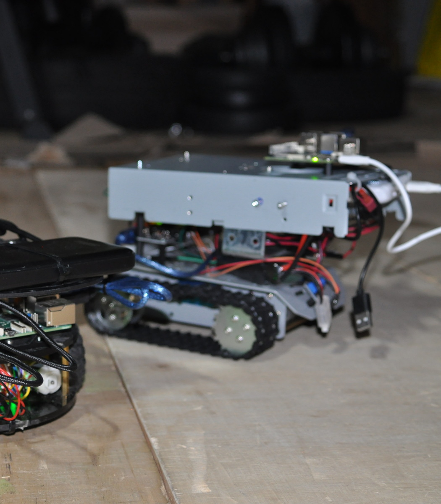
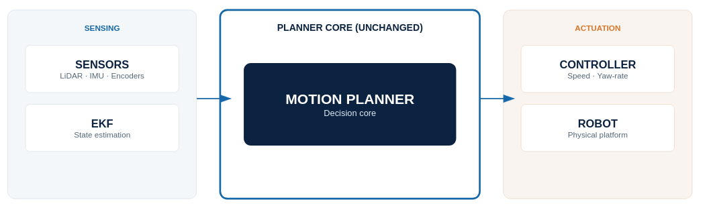
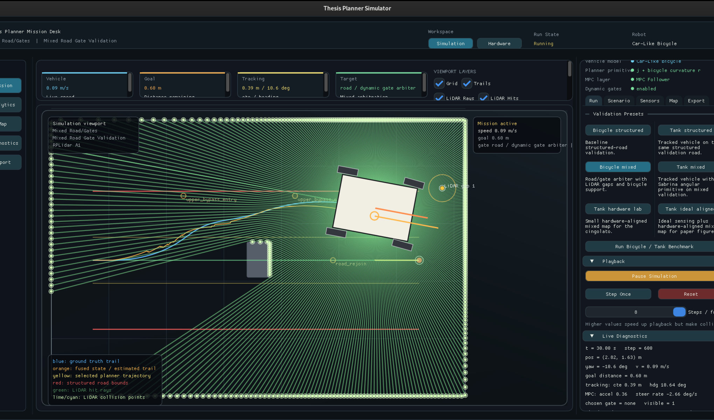
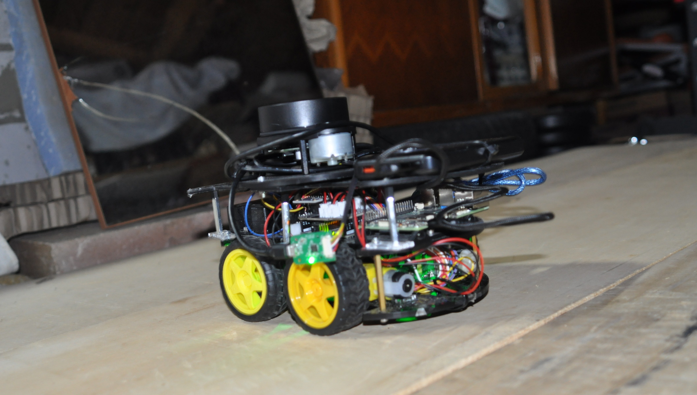
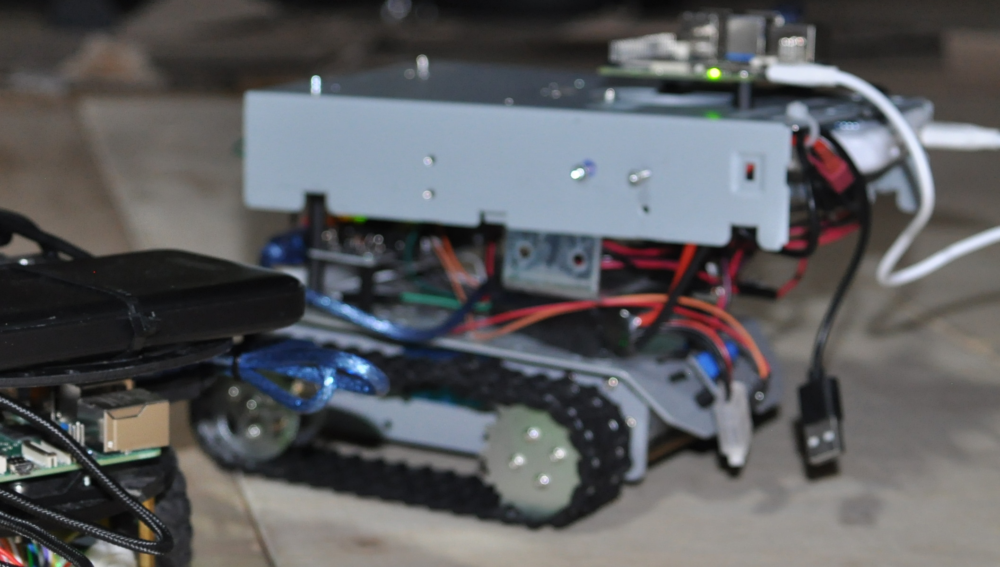
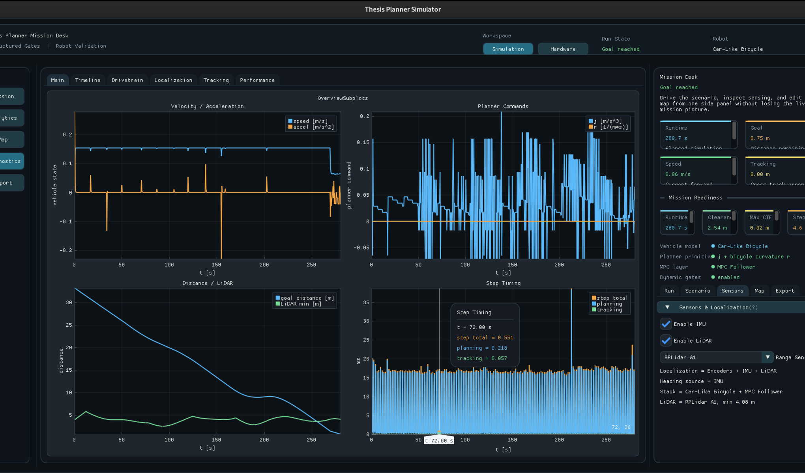

# Autonomous Agent

Sim-to-real navigation stack for validating a modular local planner on small
mobile robots. The project started as a thesis prototype and now includes a
native C++ simulator, a hardware runner, real robot communication, LiDAR-based
perception, report analysis tools, and an ArUco/OpenCV ground-truth pipeline.



## Project Overview

The repository focuses on a single question: can the same planning stack be
tested in simulation and then executed on real low-cost robotic platforms while
keeping the same control and validation logic?

To answer it, the project implements:

- a 2D C++ simulator with structured, unstructured, and mixed navigation modes;
- an integration layer for Sabrina's salience-based planner in
  `third_party/progettotesi`;
- a hardware runner for Raspberry Pi, Arduino-compatible controllers, encoders,
  IMU telemetry, and RPLidar A1 scans;
- a compact binary serial protocol between high-level planner and low-level
  firmware;
- vehicle profiles for a differential car-like robot and a tracked/skid-steer
  platform;
- LiDAR-driven gate extraction for mixed navigation around local obstacles;
- Python tools for report inspection, validation plots, and ArUco ground truth.



## What Was Built

### C++ Simulation And Planner Integration

The simulator is built around a native C++ stack. It provides map generation,
robot dynamics, LiDAR raycasting, planner execution, visualization, and
experiment reporting. The GUI uses Dear ImGui, ImPlot, and SDL2.

Supported scenarios include:

- structured road following;
- unstructured gate navigation;
- mixed road/gate navigation, where the robot follows a structured reference
  but locally switches to gate-based behavior when obstacles are detected;
- hardware-aligned maps used to reproduce laboratory experiments.



### Hardware Runner

The hardware runner reuses the same planner stack on the real robot. It can run
against synthetic sensors for smoke testing, or against the physical platform
through serial devices.

Implemented hardware modules include:

- POSIX serial communication;
- RSP-v1 packet encoder, decoder, and stream parser;
- Arduino/Raspberry bridge for motor commands and telemetry;
- RPLidar A1 driver;
- encoder, IMU, and LiDAR pose fusion;
- safety-aware command generation;
- live visualization stream for the desktop GUI.

### Vehicle Portability

The planner has been validated on two small platforms:

- a differential car-like robot used for the main sim-to-real experiments;
- a tracked/skid-steer robot used to verify that the mixed planner can be
  transferred to a different actuation model.





### Analysis And Ground Truth

The `data_analisys/` tools process simulator and hardware reports, generate
validation plots, and compare the estimated pose against an external
ArUco/OpenCV reference.

The ground-truth pipeline supports:

- ArUco/AprilTag detection;
- metric homography from four reference markers;
- robot marker pose extraction;
- marker-to-robot center offset correction;
- video/log alignment;
- CSV, JSON, SVG, PNG, and video overlay export.



## Repository Layout

```text
simulator/                 C++ simulator, hardware runner, GUI, and planner stack
simulator/include/         Public C++ interfaces
simulator/src/             Simulation, hardware bridge, LiDAR, EKF, MPC, GUI
low_level/                 Arduino-compatible firmware for robot controllers
data_analisys/             Python tools for reports, plots, and ArUco validation
documentation/             Protocol notes and architecture documentation
assets/readme/             Public README images
third_party/               External planner dependency and local support code
reports/                   Generated experiment outputs (ignored by git)
build*/                    Local build directories (ignored by git)
```

## Requirements

### System

- Linux
- CMake 3.14 or newer
- C++17 compiler
- SDL2 development package, when building the GUI
- Python 3.9 or newer for analysis scripts

Typical Ubuntu/Fedora package names vary, but the required native dependencies
are a C++ compiler, CMake, and SDL2 development headers.

### Git Submodules

The planner dependency is stored under `third_party/`. Clone with submodules:

```bash
git clone --recurse-submodules <repo_url>
cd Autonomus-Agent
```

If the repository was already cloned without submodules:

```bash
git submodule update --init --recursive
```

## Build

Build the simulator and hardware runner:

```bash
cmake -S . -B build -DTHESIS_BUILD_SIM_GUI=ON
cmake --build build --target thesis_planner_sim thesis_robot_runner -j
```

For a headless build without the GUI:

```bash
cmake -S . -B build-headless -DTHESIS_BUILD_SIM_GUI=OFF
cmake --build build-headless --target thesis_robot_runner -j
```

Optional Python bindings for the older playground are disabled by default. They
can be enabled explicitly with:

```bash
cmake -S . -B build -DAUTONOMOUS_AGENT_BUILD_PYTHON_BINDINGS=ON
```

## Run

### GUI Simulator

```bash
./build/simulator/thesis_planner_sim
```

The GUI exposes scenario selection, robot model selection, map presets, live
plots, LiDAR visualization, and report export.

### Hardware Runner In Simulation

Quick smoke test for the car-like robot:

```bash
./build/simulator/thesis_robot_runner \
  --simulate \
  --scenario mixed \
  --mixed-map obstacle \
  --vehicle-model car \
  --max-steps 800
```

Quick smoke test for the tracked robot:

```bash
./build/simulator/thesis_robot_runner \
  --simulate \
  --scenario mixed \
  --mixed-map tank \
  --vehicle-model tank \
  --max-steps 800
```

### Hardware Runner On The Real Robot

```bash
./build/simulator/thesis_robot_runner \
  --controller-port /dev/ttyACM0 \
  --lidar-port /dev/ttyUSB0 \
  --scenario mixed \
  --mixed-map hardware_aligned \
  --vehicle-model car
```

For the tracked platform, use:

```bash
./build/simulator/thesis_robot_runner \
  --controller-port /dev/ttyACM0 \
  --lidar-port /dev/ttyUSB0 \
  --scenario mixed \
  --mixed-map tank \
  --vehicle-model tank
```

Serial device names may differ depending on the machine and USB order.

## Python Analysis Tools

Install Python dependencies:

```bash
python3 -m pip install -r data_analisys/requirements.txt
```

Open the report viewer:

```bash
python3 -m data_analisys.report_viewer_qt
```

Run ArUco pose extraction on an image:

```bash
python3 -m data_analisys.aruco_pose_analysis \
  --image path/to/image.jpg \
  --config data_analisys/aruco_ground_truth_config.json \
  --output-dir data_analisys/outputs/aruco_pose
```

Run ArUco/video alignment:

```bash
python3 -m data_analisys.aruco_video_alignment --help
```

Generated reports, plots, videos, and intermediate analysis outputs are ignored
by git so that the public repository stays lightweight.

## Validation Highlights

The current stack has been used to validate:

- structured navigation in simulation and on real hardware;
- unstructured gate navigation with LiDAR-based perception;
- mixed navigation on the car-like robot, including dynamic gate activation
  around obstacles;
- mixed navigation on the tracked robot, demonstrating portability across
  different actuation models;
- external pose validation using ArUco markers and a zenith camera.

The repository contains the code needed to reproduce the simulator runs and to
process local experimental reports. Large raw videos, generated reports, and
build products are intentionally kept out of version control.

## Public Release Notes

Before publishing a new release, keep the repository focused on source code,
configuration, documentation, and small illustrative assets. Avoid committing:

- `build/`, `build-ninja/`, or other build directories;
- generated `reports/`;
- local videos and raw experiment captures;
- `.aux`, `.log`, `.toc`, and other LaTeX build artifacts;
- personal editor or environment folders.

If a large raw dataset is needed, publish it separately and link it from the
README or release notes.

## License

No public license has been declared in this repository yet. Add a `LICENSE`
file before distributing the project if external reuse should be allowed.
